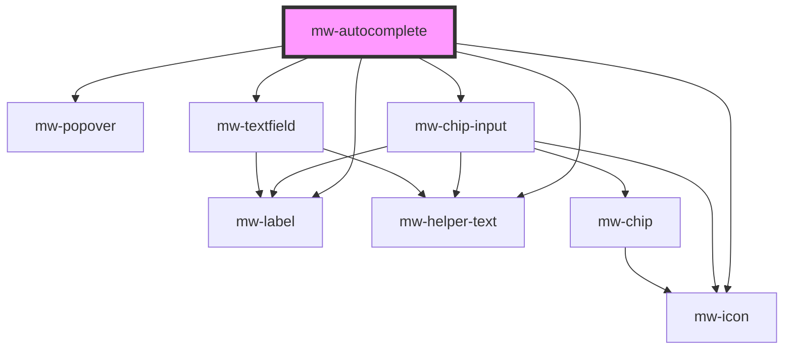

# mw-autocomplete

<!-- Auto Generated Below -->

## Properties

| Property            | Attribute             | Description                                                                                                            | Type               | Default                                        |
| ------------------- | --------------------- | ---------------------------------------------------------------------------------------------------------------------- | ------------------ | ---------------------------------------------- |
| `disabled`          | `disabled`            | Visually and functionally disabled input                                                                               | `boolean`          | `false`                                        |
| `hasError`          | `has-error`           | Use to display input and helper-text in error state                                                                    | `boolean`          | `false`                                        |
| `helperText`        | `helper-text`         | HelperText to be displayed. Can be used as hint or error text when combined with `has-error`                           | `string`           | `undefined`                                    |
| `inline`            | `inline`              | Display label and input horizontally                                                                                   | `boolean`          | `false`                                        |
| `label`             | `label`               | Label to be displayed                                                                                                  | `string`           | `undefined`                                    |
| `maximum`           | `maximum`             | Amount of allowed `selected` options                                                                                   | `number`           | `undefined`                                    |
| `maximumText`       | `maximum-text`        | Text which is displayed when maximum amount of options is reached                                                      | `string`           | `"You reached the maximum number of options."` |
| `multiple`          | `multiple`            | Allows users to enter multiple values into autocomplete                                                                | `boolean`          | `false`                                        |
| `name`              | `name`                | input field name                                                                                                       | `string`           | `undefined`                                    |
| `noSuggestionsText` | `no-suggestions-text` | Text which is displayed when no dropdown options match the user input                                                  | `string`           | `"No suggestions found."`                      |
| `optionCounter`     | `option-counter`      | Shows how many options the user has selected as well as the allowed maximum. Only works, if `maximum` prop is defined. | `boolean`          | `false`                                        |
| `placeholder`       | `placeholder`         | Placeholder to be displayed                                                                                            | `string`           | `undefined`                                    |
| `readOnly`          | `read-only`           | Whether user can't type in input field                                                                                 | `boolean`          | `false`                                        |
| `required`          | `required`            | Mark input as required                                                                                                 | `boolean`          | `false`                                        |
| `selected`          | --                    | Currently selected options                                                                                             | `string[]`         | `[]`                                           |
| `type`              | `type`                | HTML Input type                                                                                                        | `string`           | `"text"`                                       |
| `value`             | `value`               | input field value                                                                                                      | `number \| string` | `undefined`                                    |

## Events

| Event          | Description                           | Type                  |
| -------------- | ------------------------------------- | --------------------- |
| `valueChanged` | Emits an event when its value changes | `CustomEvent<string>` |

## Dependencies

### Depends on

- [mw-label](../mw-label)
- [mw-popover](../mw-popover)
- [mw-chip-input](../mw-chip-input)
- [mw-icon](../mw-icon)
- [mw-textfield](../mw-textfield)
- [mw-helper-text](../mw-helper-text)

### Graph

---

_Built with [StencilJS](https://stenciljs.com/)_
