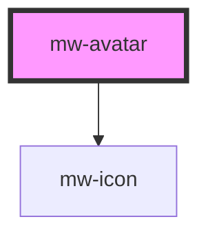

# mw-avatar

<!-- Auto Generated Below -->

## Properties

| Property | Attribute | Description                                                       | Type                                          | Default     |
| -------- | --------- | ----------------------------------------------------------------- | --------------------------------------------- | ----------- |
| `alt`    | `alt`     | Alt text, first letter used as fallback when no src or icon given | `string`                                      | `undefined` |
| `icon`   | `icon`    | Icon name. Will be ignored if `src` is provided                   | `string`                                      | `undefined` |
| `size`   | `size`    | Size variant                                                      | `"large" \| "medium" \| "small" \| "x-small"` | `'medium'`  |
| `src`    | `src`     | Image source                                                      | `string`                                      | `undefined` |
| `testId` | `test-id` | Test Id                                                           | `string`                                      | `undefined` |

## Dependencies

### Depends on

- [mw-icon](../mw-icon)

### Graph

----------------------------------------------

*Built with [StencilJS](https://stenciljs.com/)*
