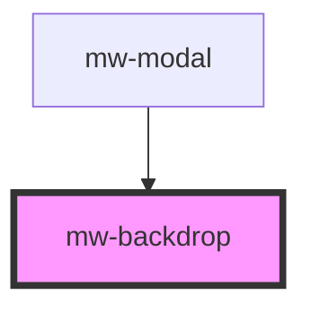

# mw-backdrop

<!-- Auto Generated Below -->

## Properties

| Property          | Attribute          | Description | Type      | Default |
| ----------------- | ------------------ | ----------- | --------- | ------- |
| `backdropDismiss` | `backdrop-dismiss` |             | `boolean` | `true`  |

## Events

| Event           | Description | Type                |
| --------------- | ----------- | ------------------- |
| `backdropClick` |             | `CustomEvent<void>` |

## Dependencies

### Used by

- [mw-modal](../mw-modal)

### Graph

---

_Built with [StencilJS](https://stenciljs.com/)_
