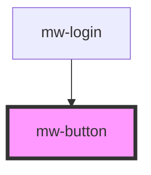

# mw-button

<!-- Auto Generated Below -->

## Properties

| Property   | Attribute  | Description                                     | Type                                                   | Default                    |
| ---------- | ---------- | ----------------------------------------------- | ------------------------------------------------------ | -------------------------- |
| `disabled` | `disabled` | Visually and functionally disable button        | `boolean`                                              | `undefined`                |
| `href`     | `href`     | If provided the button will act as a link       | `string`                                               | `undefined`                |
| `label`    | `label`    | Label to be displayed                           | `string`                                               | `undefined`                |
| `size`     | `size`     | Button size                                     | `"large" \| "medium" \| "small" \| "x-large"`          | `ButtonSizeEnum.MEDIUM`    |
| `target`   | `target`   | If using href the target prop can be provided   | `"_blank" \| "_parent" \| "_self" \| "_top"`           | `TargetEnum.SELF`          |
| `testId`   | `test-id`  | Provide unique identifier for automated testing | `string`                                               | `undefined`                |
| `title`    | `title`    | Title which is shown on hover                   | `string`                                               | `undefined`                |
| `variant`  | `variant`  | Button variants                                 | `"filled" \| "ghost" \| "ghost-inverted" \| "outline"` | `ButtonVariantEnum.FILLED` |

## Events

| Event          | Description                                                                              | Type               |
| -------------- | ---------------------------------------------------------------------------------------- | ------------------ |
| `clickEmitter` | 'onClick' event is fired when clicking the button, unless it is used with a `href` prop. | `CustomEvent<any>` |

## Shadow Parts

| Part       | Description |
| ---------- | ----------- |
| `"button"` |             |

## Dependencies

### Used by

- [mw-login](../mw-login)

### Graph

---

_Built with [StencilJS](https://stenciljs.com/)_
