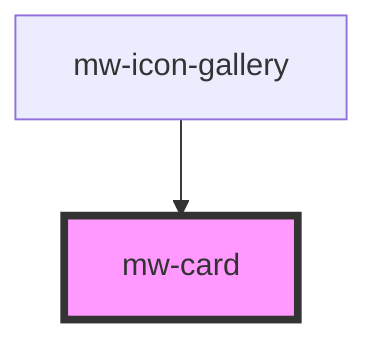

# mw-card

<!-- Auto Generated Below -->

## Properties

| Property   | Attribute  | Description                                     | Type      | Default     |
| ---------- | ---------- | ----------------------------------------------- | --------- | ----------- |
| `elevated` | `elevated` | Use box-shadow for elevation style              | `boolean` | `false`     |
| `outlined` | `outlined` | Display outline                                 | `boolean` | `false`     |
| `testId`   | `test-id`  | Provide unique identifier for automated testing | `string`  | `undefined` |

## Events

| Event          | Description | Type               |
| -------------- | ----------- | ------------------ |
| `clickEmitter` |             | `CustomEvent<any>` |

## Dependencies

### Used by

 - [mw-icon-gallery](../mw-icon-gallery)

### Graph

----------------------------------------------

*Built with [StencilJS](https://stenciljs.com/)*
