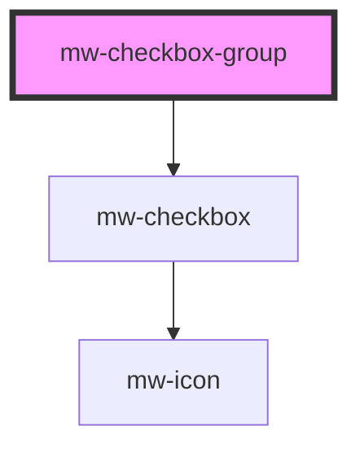

# mw-checkbox-group

<!-- Auto Generated Below -->

## Properties

| Property      | Attribute      | Description                              | Type                                                     | Default     |
| ------------- | -------------- | ---------------------------------------- | -------------------------------------------------------- | ----------- |
| `direction`   | `direction`    | Dictates the flex direction of the group | `"column" \| "column-reverse" \| "row" \| "row-reverse"` | `"column"`  |
| `parentLabel` | `parent-label` | Label of parent checkbox                 | `string`                                                 | `undefined` |
| `value`       | --             | Current value of the checkbox-group      | `(string \| number)[]`                                   | `[]`        |
| `wrap`        | `wrap`         | Dictates whether group should flex-wrap  | `boolean`                                                | `false`     |

## Events

| Event            | Description                                                         | Type                                             |
| ---------------- | ------------------------------------------------------------------- | ------------------------------------------------ |
| `checkboxChange` | Event emitted when radioGroup value changes (after radio selection) | `CustomEvent<{ value?: (string \| number)[]; }>` |

## Dependencies

### Depends on

- [mw-checkbox](../mw-checkbox)

### Graph

---

_Built with [StencilJS](https://stenciljs.com/)_
