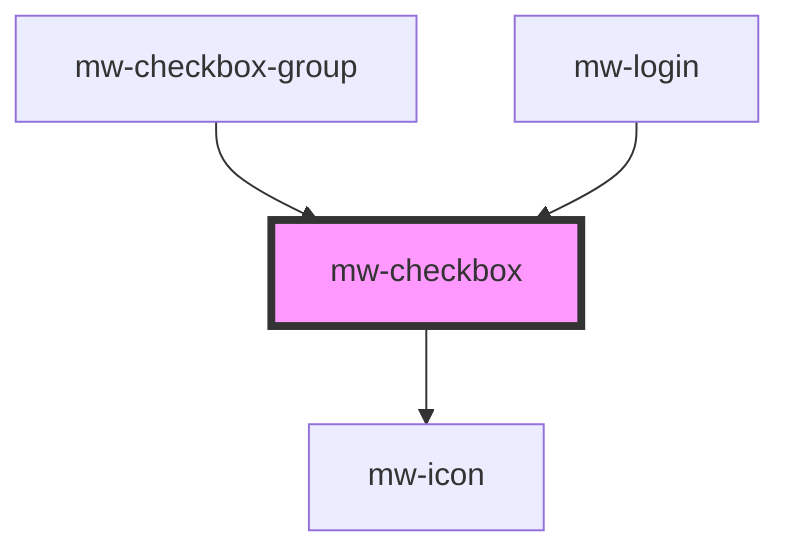

# mw-checkbox

<!-- Auto Generated Below -->

## Properties

| Property        | Attribute        | Description                                                         | Type                                      | Default              |
| --------------- | ---------------- | ------------------------------------------------------------------- | ----------------------------------------- | -------------------- |
| `checked`       | `checked`        | Whether input is checked                                            | `boolean`                                 | `false`              |
| `disabled`      | `disabled`       | Whether input is disabled                                           | `boolean`                                 | `false`              |
| `indeterminate` | `indeterminate`  | Whether input is set to indeterminate (overwrites check to 'false') | `boolean`                                 | `false`              |
| `label`         | `label`          | Label to be displayed                                               | `string`                                  | `undefined`          |
| `labelPosition` | `label-position` | Dictates on which side of checkbox the label is placed              | `PositionEnum.LEFT \| PositionEnum.RIGHT` | `PositionEnum.RIGHT` |
| `name`          | `name`           | Name of checkbox input                                              | `string`                                  | `undefined`          |
| `testId`        | `test-id`        | Provide unique identifier for automated testing                     | `string`                                  | `undefined`          |
| `value`         | `value`          | Value of checkbox input                                             | `string`                                  | `undefined`          |

## Events

| Event     | Description                                                      | Type               |
| --------- | ---------------------------------------------------------------- | ------------------ |
| `emitter` | MwCheckbox emits an event when checkbox checked state is changed | `CustomEvent<any>` |

## Dependencies

### Used by

- [mw-checkbox-group](../mw-checkbox-group)
- [mw-login](../mw-login)

### Depends on

- [mw-icon](../mw-icon)

### Graph

---

_Built with [StencilJS](https://stenciljs.com/)_
