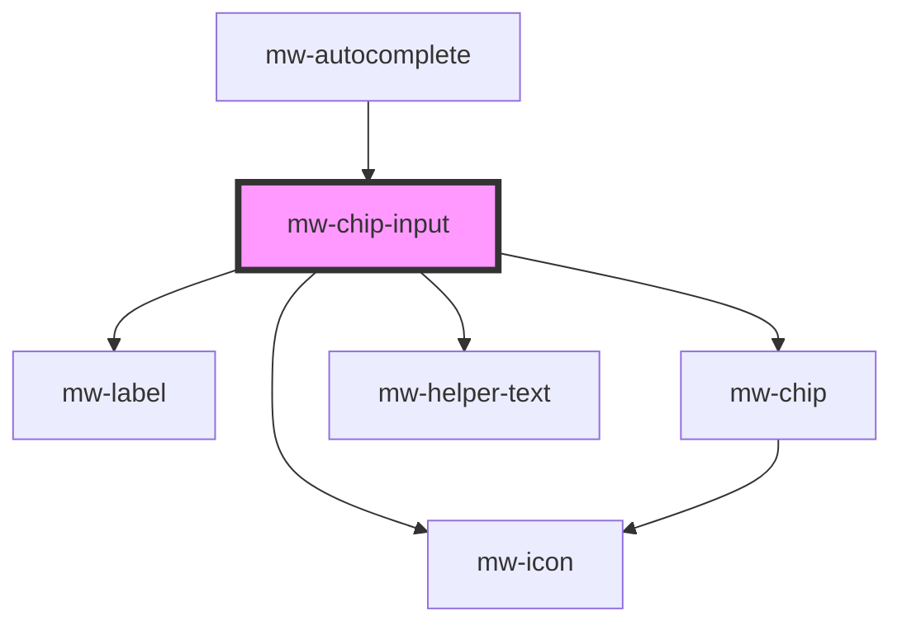

# mw-chip-input

<!-- Auto Generated Below -->

## Properties

| Property        | Attribute        | Description                                                                                                            | Type               | Default     |
| --------------- | ---------------- | ---------------------------------------------------------------------------------------------------------------------- | ------------------ | ----------- |
| `disabled`      | `disabled`       | Visually and functionally disabled input                                                                               | `boolean`          | `false`     |
| `hasError`      | `has-error`      | Use to display input and helper-text in error state                                                                    | `boolean`          | `false`     |
| `helperText`    | `helper-text`    | Shows how many options the user has selected as well as the allowed maximum. Only works, if `maximum` prop is defined. | `string`           | `undefined` |
| `inline`        | `inline`         | Display label and input horizontally                                                                                   | `boolean`          | `false`     |
| `label`         | `label`          | Label to be displayed                                                                                                  | `string`           | `undefined` |
| `maximum`       | `maximum`        | Amount of allowed `selected` values                                                                                    | `number`           | `undefined` |
| `name`          | `name`           | input field name                                                                                                       | `string`           | `undefined` |
| `optionCounter` | `option-counter` | Amount of currently selected options                                                                                   | `boolean`          | `false`     |
| `placeholder`   | `placeholder`    | Placeholder to be displayed                                                                                            | `string`           | `undefined` |
| `required`      | `required`       | Mark input as required                                                                                                 | `boolean`          | `false`     |
| `selectedChips` | --               | Currently selected Values                                                                                              | `string[]`         | `undefined` |
| `value`         | `value`          | input field value                                                                                                      | `number \| string` | `undefined` |

## Events

| Event          | Description                                | Type                    |
| -------------- | ------------------------------------------ | ----------------------- |
| `inputChange`  | Emits an event when value of input changes | `CustomEvent<string>`   |
| `valueChanged` | Emits an event when its value changes      | `CustomEvent<string[]>` |

## Dependencies

### Used by

- [mw-autocomplete](../mw-autocomplete)

### Depends on

- [mw-label](../mw-label)
- [mw-chip](../mw-chip)
- [mw-icon](../mw-icon)
- [mw-helper-text](../mw-helper-text)

### Graph

---

_Built with [StencilJS](https://stenciljs.com/)_
