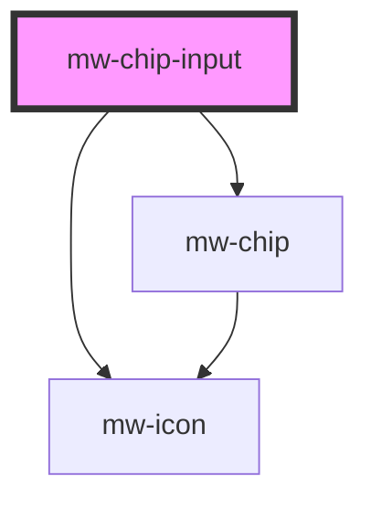

# mw-chip-input

<!-- Auto Generated Below -->

## Properties

| Property              | Attribute               | Description                                                                                                                    | Type                   | Default                                        |
| --------------------- | ----------------------- | ------------------------------------------------------------------------------------------------------------------------------ | ---------------------- | ---------------------------------------------- |
| `disabled`            | `disabled`              | Visually and functionally disabled input                                                                                       | `boolean`              | `false`                                        |
| `hasError`            | `has-error`             | Use to display input and helper-text in error state                                                                            | `boolean`              | `false`                                        |
| `helperText`          | `helper-text`           | HelperText to be displayed. Can be used as hint or error text when combined with `has-error`                                   | `string`               | `undefined`                                    |
| `inline`              | `inline`                | Display label and input horizontally                                                                                           | `boolean`              | `false`                                        |
| `label`               | `label`                 | Label to be displayed                                                                                                          | `string`               | `undefined`                                    |
| `multiple`            | `multiple`              | Allows users to enter multiple values into autocomplete                                                                        | `boolean`              | `false`                                        |
| `multipleMaximum`     | `multiple-maximum`      | Amount of allowed `multipleValues`                                                                                             | `number`               | `undefined`                                    |
| `multipleMaximumText` | `multiple-maximum-text` | Text which is displayed when maximum amount of options is reached                                                              | `string`               | `"Maximum amount of selected options reached"` |
| `multipleValues`      | --                      | Values, when `multiple` is true                                                                                                | `(string \| number)[]` | `[]`                                           |
| `name`                | `name`                  | input field name                                                                                                               | `string`               | `undefined`                                    |
| `noMatchText`         | `no-match-text`         | Text which is displayed when no dropdown options match the user input                                                          | `string`               | `"No matching options"`                        |
| `optionCounter`       | `option-counter`        | Shows how many options the user has selected as well as the allowed maximum. Only works, if `multipleMaximum` prop is defined. | `boolean`              | `false`                                        |
| `placeholder`         | `placeholder`           | Placeholder to be displayed                                                                                                    | `string`               | `undefined`                                    |
| `readOnly`            | `read-only`             | Whether user can't type in input field                                                                                         | `boolean`              | `false`                                        |
| `required`            | `required`              | Mark input as required                                                                                                         | `boolean`              | `false`                                        |
| `type`                | `type`                  | HTML Input type                                                                                                                | `string`               | `"text"`                                       |
| `value`               | `value`                 | input field value                                                                                                              | `number \| string`     | `undefined`                                    |

## Events

| Event          | Description                                          | Type                  |
| -------------- | ---------------------------------------------------- | --------------------- |
| `valueChanged` | MwAutocomplete emits an event when its value changes | `CustomEvent<string>` |

## Dependencies

### Depends on

- [mw-chip](../mw-chip)
- [mw-icon](../mw-icon)

### Graph

---

_Built with [StencilJS](https://stenciljs.com/)_
