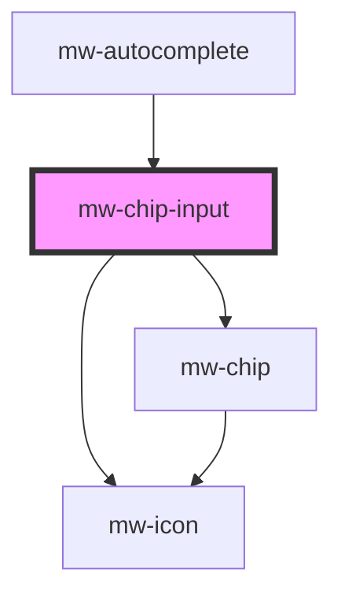

# mw-chip-input

<!-- Auto Generated Below -->

## Properties

| Property              | Attribute               | Description                                                                                                                    | Type       | Default                                        |
| --------------------- | ----------------------- | ------------------------------------------------------------------------------------------------------------------------------ | ---------- | ---------------------------------------------- |
| `disabled`            | `disabled`              | Visually and functionally disabled input                                                                                       | `boolean`  | `false`                                        |
| `label`               | `label`                 | Label to be displayed                                                                                                          | `string`   | `undefined`                                    |
| `multipleMaximum`     | `multiple-maximum`      | Amount of allowed `multipleValues`                                                                                             | `number`   | `undefined`                                    |
| `multipleMaximumText` | `multiple-maximum-text` | Text which is displayed when maximum amount of options is reached                                                              | `string`   | `"Maximum amount of selected options reached"` |
| `name`                | `name`                  | input field name                                                                                                               | `string`   | `undefined`                                    |
| `optionCounter`       | `option-counter`        | Shows how many options the user has selected as well as the allowed maximum. Only works, if `multipleMaximum` prop is defined. | `boolean`  | `false`                                        |
| `placeholder`         | `placeholder`           | Placeholder to be displayed                                                                                                    | `string`   | `undefined`                                    |
| `readOnly`            | `read-only`             | Whether user can't type in input field                                                                                         | `boolean`  | `false`                                        |
| `selected`            | --                      |                                                                                                                                | `string[]` | `undefined`                                    |

## Events

| Event                    | Description                                | Type                    |
| ------------------------ | ------------------------------------------ | ----------------------- |
| `mwChipListInputChange`  | Emits an event when value of input changes | `CustomEvent<string>`   |
| `mwChipListValueChanged` | Emits an event when its value changes      | `CustomEvent<string[]>` |

## Dependencies

### Used by

- [mw-autocomplete](../mw-autocomplete)

### Depends on

- [mw-chip](../mw-chip)
- [mw-icon](../mw-icon)

### Graph

---

_Built with [StencilJS](https://stenciljs.com/)_
