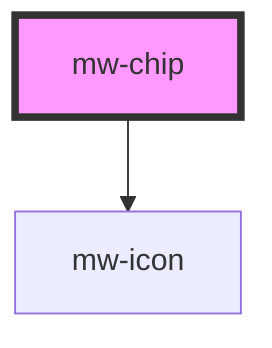

# mw-chip

<!-- Auto Generated Below -->

## Properties

| Property              | Attribute    | Description                                                        | Type      | Default     |
| --------------------- | ------------ | ------------------------------------------------------------------ | --------- | ----------- |
| `disabled`            | `disabled`   | Visually and functionally disable button                           | `boolean` | `undefined` |
| `icon`                | `icon`       | Name identifier of icon to be displayed in chip                    | `string`  | `undefined` |
| `selected`            | `selected`   | Selection state that changes onToggle. Can be set as mutable prop. | `boolean` | `false`     |
| `showClose`           | `show-close` | Flag wether to show close icon or not                              | `boolean` | `false`     |
| `testId` _(required)_ | `test-id`    | Provide unique identifier for automated testing                             | `string`  | `undefined` |

## Events

| Event    | Description                                                                           | Type                   |
| -------- | ------------------------------------------------------------------------------------- | ---------------------- |
| `close`  | 'close' event is fired when the close icon is clicked.                                | `CustomEvent<any>`     |
| `toggle` | 'toggle' event is fired when the chip is clicked. Current selection state is emitted. | `CustomEvent<boolean>` |

## Dependencies

### Depends on

- [mw-icon](../mw-icon)

### Graph

----------------------------------------------

*Built with [StencilJS](https://stenciljs.com/)*
