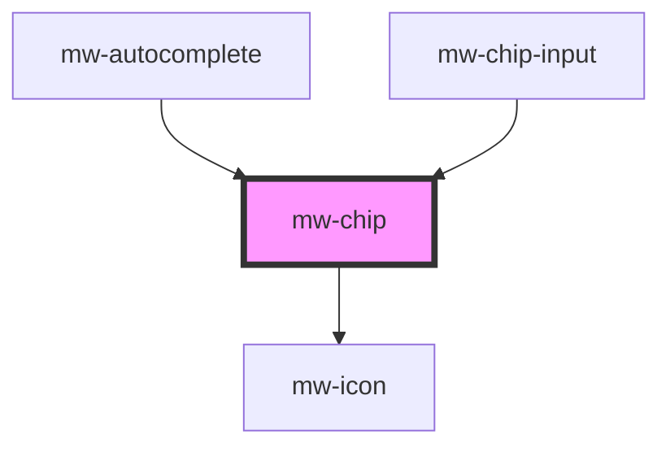

# mw-chip

<!-- Auto Generated Below -->

## Properties

| Property     | Attribute    | Description                                                        | Type               | Default     |
| ------------ | ------------ | ------------------------------------------------------------------ | ------------------ | ----------- |
| `disabled`   | `disabled`   | Visually and functionally disable button                           | `boolean`          | `undefined` |
| `icon`       | `icon`       | Name identifier of icon to be displayed in chip                    | `string`           | `undefined` |
| `selected`   | `selected`   | Selection state that changes onToggle. Can be set as mutable prop. | `boolean`          | `false`     |
| `showClose`  | `show-close` | Flag whether to show close icon or not                             | `boolean`          | `false`     |
| `testId`     | `test-id`    | Provide unique identifier for automated testing                    | `string`           | `undefined` |
| `toggleable` | `toggleable` | Allows user to toggle chip                                         | `boolean`          | `true`      |
| `value`      | `value`      | Value of chip                                                      | `number \| string` | `undefined` |

## Events

| Event         | Description                                | Type               |
| ------------- | ------------------------------------------ | ------------------ |
| `mwChipClick` | MwChip emits an event when chip is clicked | `CustomEvent<any>` |
| `mwChipClose` | MwChip emits an event when chip is closed  | `CustomEvent<any>` |

## Dependencies

### Used by

- [mw-autocomplete](../mw-autocomplete)
- [mw-chip-input](../mw-chip-input)

### Depends on

- [mw-icon](../mw-icon)

### Graph

---

_Built with [StencilJS](https://stenciljs.com/)_
