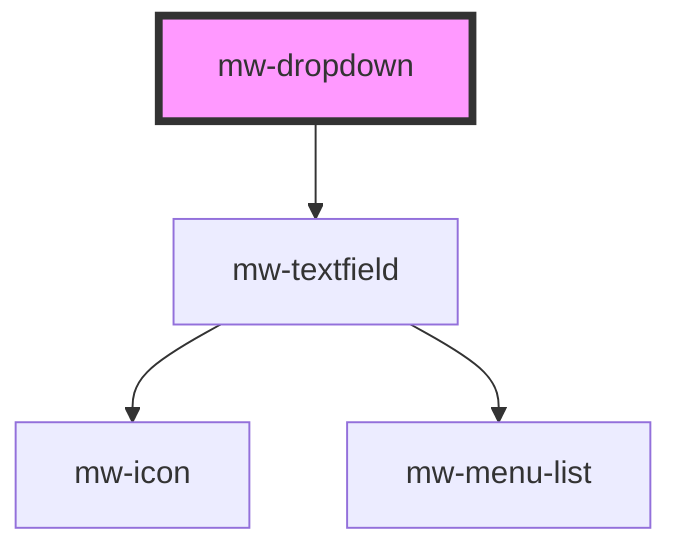

# mw-dropdown

<!-- Auto Generated Below -->

## Properties

| Property      | Attribute     | Description                                                                                  | Type               | Default     |
| ------------- | ------------- | -------------------------------------------------------------------------------------------- | ------------------ | ----------- |
| `disabled`    | `disabled`    | Visually and functionally disabled input                                                     | `boolean`          | `false`     |
| `hasError`    | `has-error`   | Use to display input and helper-text in error state                                          | `boolean`          | `false`     |
| `helperText`  | `helper-text` | HelperText to be displayed. Can be used as hint or error text when combined with `has-error` | `string`           | `undefined` |
| `inline`      | `inline`      | Display label and input horizonally                                                          | `boolean`          | `false`     |
| `label`       | `label`       | Label to be displayed                                                                        | `string`           | `undefined` |
| `name`        | `name`        | input field name                                                                             | `string`           | `undefined` |
| `placeholder` | `placeholder` | Placeholder to be displayed                                                                  | `string`           | `undefined` |
| `required`    | `required`    | Mark input as required                                                                       | `boolean`          | `false`     |
| `value`       | `value`       | input field value                                                                            | `number \| string` | `undefined` |

## Dependencies

### Depends on

- [mw-textfield](../mw-textfield)

### Graph

---

_Built with [StencilJS](https://stenciljs.com/)_
