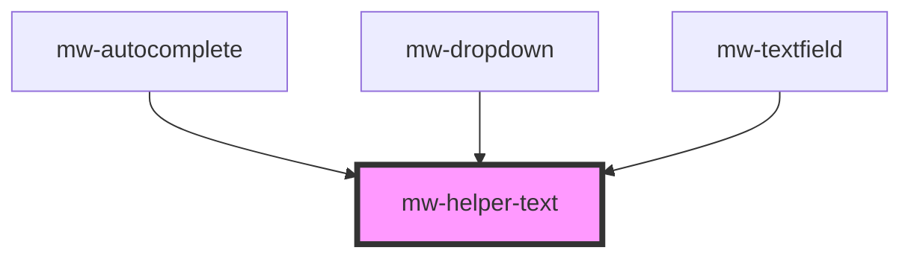

# mw-helper-text

<!-- Auto Generated Below -->

## Properties

| Property     | Attribute     | Description          | Type      | Default     |
| ------------ | ------------- | -------------------- | --------- | ----------- |
| `hasError`   | `has-error`   | Displays error       | `boolean` | `false`     |
| `helperText` | `helper-text` | Text to be displayed | `string`  | `undefined` |

## Dependencies

### Used by

- [mw-autocomplete](../mw-autocomplete)
- [mw-dropdown](../mw-dropdown)
- [mw-textfield](../mw-textfield)

### Graph

---

_Built with [StencilJS](https://stenciljs.com/)_
