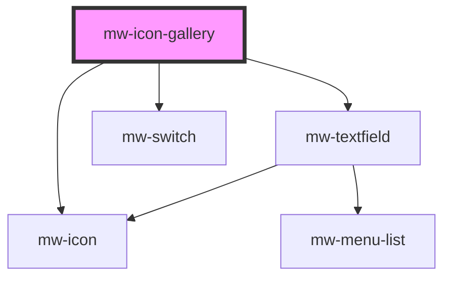

# mw-icon-gallery

<!-- Auto Generated Below -->

## Properties

| Property | Attribute | Description                       | Type       | Default |
| -------- | --------- | --------------------------------- | ---------- | ------- |
| `icons`  | --        | The icons that should be rendered | `string[]` | `icons` |

## Dependencies

### Depends on

- [mw-textfield](../mw-textfield)
- [mw-icon](../mw-icon)
- [mw-switch](../mw-switch)

### Graph

---

_Built with [StencilJS](https://stenciljs.com/)_
