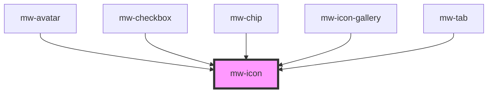

# mw-icon

<!-- Auto Generated Below -->

## Properties

| Property | Attribute | Description                  | Type                                          | Default          |
| -------- | --------- | ---------------------------- | --------------------------------------------- | ---------------- |
| `fill`   | `fill`    | Overwrite fill color         | `string`                                      | `'currentColor'` |
| `icon`   | `icon`    | The icon name to be rendered | `string`                                      | `null`           |
| `size`   | `size`    | Size variant                 | `"large" \| "medium" \| "small" \| "x-small"` | `'medium'`       |
| `stroke` | `stroke`  | Overwrite stroke color       | `string`                                      | `'none'`         |

## Dependencies

### Used by

 - [mw-avatar](../mw-avatar)
 - [mw-checkbox](../mw-checkbox)
 - [mw-chip](../mw-chip)
 - [mw-icon-gallery](../mw-icon-gallery)
 - [mw-tab](../mw-tab)

### Graph

----------------------------------------------

*Built with [StencilJS](https://stenciljs.com/)*
