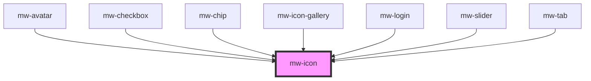

# mw-icon

<!-- Auto Generated Below -->

## Properties

| Property | Attribute | Description                                                                                                                                                                                                                                                                                                                                      | Type                                                       | Default          |
| -------- | --------- | ------------------------------------------------------------------------------------------------------------------------------------------------------------------------------------------------------------------------------------------------------------------------------------------------------------------------------------------------ | ---------------------------------------------------------- | ---------------- |
| `color`  | `color`   | Icon color                                                                                                                                                                                                                                                                                                                                       | `string`                                                   | `undefined`      |
| `fill`   | `fill`    | Fill gives you the ability to modify the default icon style. A single icon can render both unfilled and filled states.                                                                                                                                                                                                                           | `boolean`                                                  | `false`          |
| `icon`   | `icon`    | The icon name to be rendered                                                                                                                                                                                                                                                                                                                     | `string`                                                   | `null`           |
| `size`   | `size`    | This controls both optical size and font-size. Font-size can be set independently in styles. (Optical) size for the image to look the same at different sizes, the stroke weight (thickness) changes as the icon size scales. Optical size offers a way to automatically adjust the stroke weight when you increase or decrease the symbol size. | `"large" \| "medium" \| "small" \| "x-large" \| "x-small"` | `SizeEnum.SMALL` |
| `weight` | `weight`  | Weight defines the symbol’s stroke weight, with a range of weights between thin (100) and bold (700). Weight can also affect the overall size of the symbol.                                                                                                                                                                                     | `number`                                                   | `400`            |

## Dependencies

### Used by

 - [mw-avatar](../mw-avatar)
 - [mw-checkbox](../mw-checkbox)
 - [mw-chip](../mw-chip)
 - [mw-icon-gallery](../mw-icon-gallery)
 - [mw-login](../mw-login)
 - [mw-slider](../mw-slider)
 - [mw-tab](../mw-tab)

### Graph

----------------------------------------------

*Built with [StencilJS](https://stenciljs.com/)*
