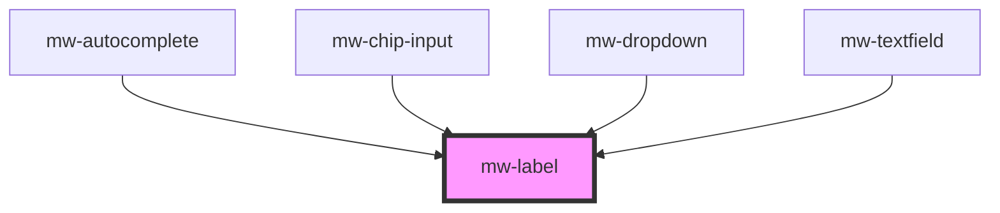

# mw-label

<!-- Auto Generated Below -->

## Properties

| Property   | Attribute  | Description                                                | Type      | Default     |
| ---------- | ---------- | ---------------------------------------------------------- | --------- | ----------- |
| `label`    | `label`    | Text of the label                                          | `string`  | `undefined` |
| `name`     | `name`     | Name of input field connected to label                     | `string`  | `undefined` |
| `required` | `required` | Wether or not the input connected to the label is required | `boolean` | `false`     |

## Dependencies

### Used by

- [mw-autocomplete](../mw-autocomplete)
- [mw-chip-input](../mw-chip-input)
- [mw-dropdown](../mw-dropdown)
- [mw-textfield](../mw-textfield)

### Graph

---

_Built with [StencilJS](https://stenciljs.com/)_
