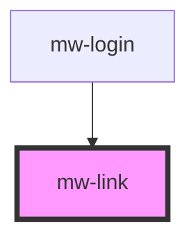

# mw-link

<!-- Auto Generated Below -->

## Properties

| Property            | Attribute   | Description                            | Type                                         | Default           |
| ------------------- | ----------- | -------------------------------------- | -------------------------------------------- | ----------------- |
| `href` _(required)_ | `href`      | URL to where the link should lead      | `string`                                     | `undefined`       |
| `target`            | `target`    | Target Prop for HTML 'a' tag           | `"_blank" \| "_parent" \| "_self" \| "_top"` | `TargetEnum.SELF` |
| `underline`         | `underline` | Dictates whether link has an underline | `boolean`                                    | `true`            |

## Dependencies

### Used by

- [mw-login](../mw-login)

### Graph

---

_Built with [StencilJS](https://stenciljs.com/)_
