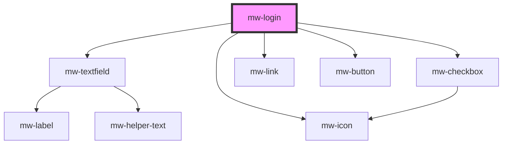

# mw-login

<!-- Auto Generated Below -->

## Properties

| Property             | Attribute              | Description                                                  | Type                           | Default                  |
| -------------------- | ---------------------- | ------------------------------------------------------------ | ------------------------------ | ------------------------ |
| `backgroundImage`    | `background-image`     | URL to the image that should be displayed                    | `string`                       | `undefined`              |
| `forgotPasswordHref` | `forgot-password-href` | Wether or not the forgot password button should be displayed | `string`                       | `undefined`              |
| `headline`           | `headline`             | Headline text                                                | `string`                       | `undefined`              |
| `layout`             | `layout`               | In which layout the Login component should be displayed      | `"center" \| "end" \| "start"` | `LoginLayoutEnum.CENTER` |
| `logo`               | `logo`                 | URL to the image that should be displayed                    | `string`                       | `undefined`              |
| `signUpHref`         | `sign-up-href`         | Wether or not the signUp prompt should be displayed          | `string`                       | `undefined`              |

## Events

| Event           | Description                                  | Type                         |
| --------------- | -------------------------------------------- | ---------------------------- |
| `submitEmitter` | Event emitted after login button was clicked | `CustomEvent<LoginFormData>` |

## Dependencies

### Depends on

- [mw-textfield](../mw-textfield)
- [mw-icon](../mw-icon)
- [mw-checkbox](../mw-checkbox)
- [mw-link](../mw-link)
- [mw-button](../mw-button)

### Graph

---

_Built with [StencilJS](https://stenciljs.com/)_
