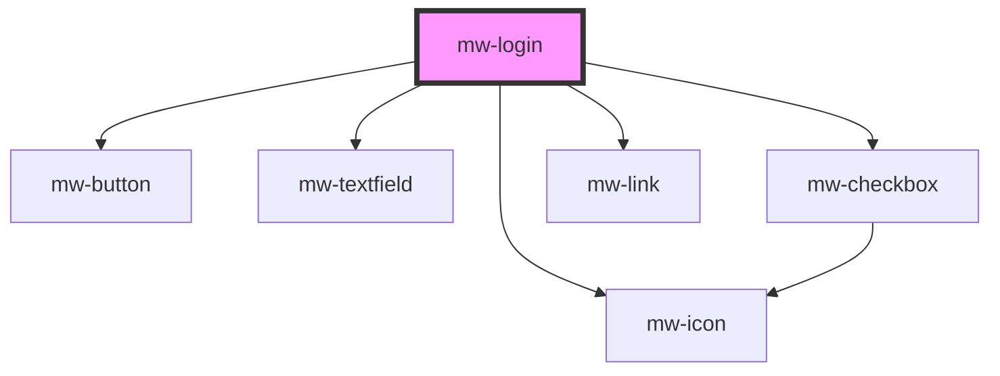

# mw-login

<!-- Auto Generated Below -->

## Properties

| Property                   | Attribute                     | Description                                                  | Type                           | Default                  |
| -------------------------- | ----------------------------- | ------------------------------------------------------------ | ------------------------------ | ------------------------ |
| `backgroundImage`          | `background-image`            | URL to the image that should be displayed                    | `string`                       | `undefined`              |
| `headline`                 | `headline`                    | Headline text                                                | `string`                       | `undefined`              |
| `layout`                   | `layout`                      | In which layout the Login component should be displayed      | `"center" \| "end" \| "start"` | `LoginLayoutEnum.CENTER` |
| `logo`                     | `logo`                        | URL to the image that should be displayed                    | `string`                       | `undefined`              |
| `showForgotPasswordButton` | `show-forgot-password-button` | Wether or not the forgot password button should be displayed | `boolean`                      | `true`                   |
| `showSignUpPrompt`         | `show-sign-up-prompt`         | Wether or not the signUp prompt should be displayed          | `boolean`                      | `true`                   |

## Dependencies

### Depends on

- [mw-button](../mw-button)
- [mw-textfield](../mw-textfield)
- [mw-icon](../mw-icon)
- [mw-checkbox](../mw-checkbox)
- [mw-link](../mw-link)

### Graph

---

_Built with [StencilJS](https://stenciljs.com/)_
