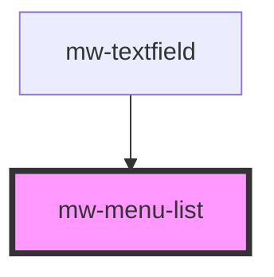

# mw-menu-list

<!-- Auto Generated Below -->

## Properties

| Property | Attribute | Description                                     | Type     | Default     |
| -------- | --------- | ----------------------------------------------- | -------- | ----------- |
| `testId` | `test-id` | Provide unique identifier for automated testing | `string` | `undefined` |

## Dependencies

### Used by

- [mw-textfield](../mw-textfield)

### Graph

---

_Built with [StencilJS](https://stenciljs.com/)_
