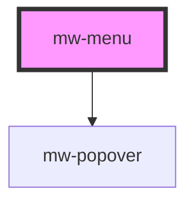

# mw-menu

<!-- Auto Generated Below -->

## Properties

| Property              | Attribute   | Description                            | Type                                                                                                                                                                 | Default        |
| --------------------- | ----------- | -------------------------------------- | -------------------------------------------------------------------------------------------------------------------------------------------------------------------- | -------------- |
| `open`                | `open`      | Whether the menu is open               | `boolean`                                                                                                                                                            | `false`        |
| `placement`           | `placement` | Placement relative to anchor element   | `"bottom" \| "bottom-end" \| "bottom-start" \| "left" \| "left-end" \| "left-start" \| "right" \| "right-end" \| "right-start" \| "top" \| "top-end" \| "top-start"` | `'bottom-end'` |
| `testId` _(required)_ | `test-id`   | Must be provided for automated testing | `string`                                                                                                                                                             | `undefined`    |

## Dependencies

### Depends on

- [mw-popover](../mw-popover)

### Graph

----------------------------------------------

*Built with [StencilJS](https://stenciljs.com/)*
