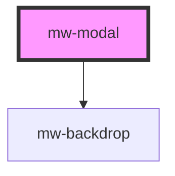

# mw-modal

<!-- Auto Generated Below -->

## Properties

| Property          | Attribute          | Description | Type           | Default     |
| ----------------- | ------------------ | ----------- | -------------- | ----------- |
| `backdropDismiss` | `backdrop-dismiss` |             | `boolean`      | `true`      |
| `component`       | --                 |             | `ComponentRef` | `undefined` |
| `dismissTrigger`  | `dismiss-trigger`  |             | `string`       | `undefined` |
| `trigger`         | `trigger`          |             | `string`       | `undefined` |

## Methods

### `dismiss() => Promise<void>`

Method to dismiss the modal

#### Returns

Type: `Promise<void>`

### `present() => Promise<void>`

Method to present the modal

#### Returns

Type: `Promise<void>`

## Shadow Parts

| Part         | Description |
| ------------ | ----------- |
| `"backdrop"` |             |

## Dependencies

### Depends on

- [mw-backdrop](../mw-backdrop)

### Graph

---

_Built with [StencilJS](https://stenciljs.com/)_
