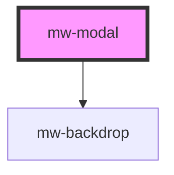

# mw-modal

<!-- Auto Generated Below -->

## Properties

| Property          | Attribute          | Description                                               | Type                   | Default                 |
| ----------------- | ------------------ | --------------------------------------------------------- | ---------------------- | ----------------------- |
| `backdropDismiss` | `backdrop-dismiss` | Determines wether or not backdrop should dismiss modal    | `boolean`              | `true`                  |
| `dismissTrigger`  | `dismiss-trigger`  | id used to dismiss the modal                              | `string`               | `undefined`             |
| `isOpen`          | `is-open`          | Modal can be opened closed with this input property       | `boolean`              | `false`                 |
| `size`            | `size`             | Determines the max size that the modal takes horizontally | `"default" \| "small"` | `ModalSizeEnum.DEFAULT` |
| `trigger`         | `trigger`          | id used to present the modal                              | `string`               | `undefined`             |

## Methods

### `dismiss() => Promise<void>`

Method to dismiss the modal

#### Returns

Type: `Promise<void>`

### `present() => Promise<void>`

Method to present the modal

#### Returns

Type: `Promise<void>`

## Shadow Parts

| Part         | Description |
| ------------ | ----------- |
| `"backdrop"` |             |
| `"content"`  |             |

## Dependencies

### Depends on

- [mw-backdrop](../mw-backdrop)

### Graph

----------------------------------------------

*Built with [StencilJS](https://stenciljs.com/)*
