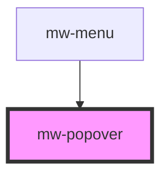

# mw-popover

<!-- Auto Generated Below -->

## Properties

| Property      | Attribute     | Description                                                   | Type                                                                                                                                                                 | Default     |
| ------------- | ------------- | ------------------------------------------------------------- | -------------------------------------------------------------------------------------------------------------------------------------------------------------------- | ----------- |
| `dismissable` | `dismissable` | If set to true, the popover can be closed by clicking outside | `boolean`                                                                                                                                                            | `false`     |
| `name`        | `name`        | Name used internally to reference anchor and content elements | `string`                                                                                                                                                             | `"tooltip"` |
| `noPadding`   | `no-padding`  | disable default padding                                       | `boolean`                                                                                                                                                            | `false`     |
| `open`        | `open`        | Whether the popover is visible                                | `boolean`                                                                                                                                                            | `undefined` |
| `placement`   | `placement`   | Placement relative to anchor element                          | `"bottom" \| "bottom-end" \| "bottom-start" \| "left" \| "left-end" \| "left-start" \| "right" \| "right-end" \| "right-start" \| "top" \| "top-end" \| "top-start"` | `"bottom"`  |
| `testId`      | `test-id`     | Provide unique identifier for automated testing               | `string`                                                                                                                                                             | `undefined` |

## Dependencies

### Used by

 - [mw-menu](../mw-menu)

### Graph

----------------------------------------------

*Built with [StencilJS](https://stenciljs.com/)*
