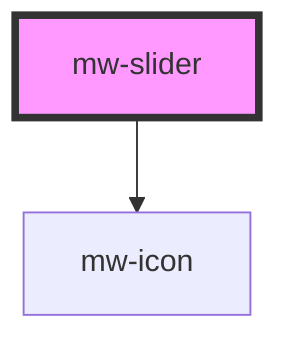

# mw-slider

<!-- Auto Generated Below -->

## Properties

| Property     | Attribute     | Description                                     | Type      | Default     |
| ------------ | ------------- | ----------------------------------------------- | --------- | ----------- |
| `disabled`   | `disabled`    | Disable range input                             | `boolean` | `false`     |
| `endIcon`    | `end-icon`    | Icon to be displayed to right of the slider     | `string`  | `undefined` |
| `helperText` | `helper-text` | input helper-text                               | `string`  | `undefined` |
| `inline`     | `inline`      | Display label and input horizonally             | `boolean` | `false`     |
| `label`      | `label`       | input label                                     | `string`  | `undefined` |
| `max`        | `max`         | max range value                                 | `number`  | `100`       |
| `min`        | `min`         | min range value                                 | `number`  | `0`         |
| `name`       | `name`        | Name of range input                             | `string`  | `undefined` |
| `startIcon`  | `start-icon`  | Icon to be displayed to left of the slider      | `string`  | `undefined` |
| `step`       | `step`        | step for range value                            | `number`  | `1`         |
| `testId`     | `test-id`     | Provide unique identifier for automated testing | `string`  | `undefined` |
| `value`      | `value`       | value of range input                            | `number`  | `0`         |

## Dependencies

### Depends on

- [mw-icon](../mw-icon)

### Graph

---

_Built with [StencilJS](https://stenciljs.com/)_
