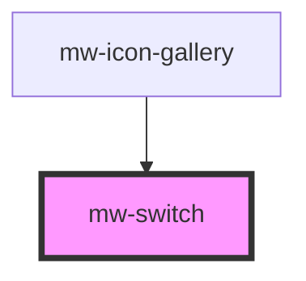

# mw-switch

<!-- Auto Generated Below -->

## Properties

| Property   | Attribute  | Description                                                            | Type      | Default     |
| ---------- | ---------- | ---------------------------------------------------------------------- | --------- | ----------- |
| `checked`  | `checked`  | Switch state                                                           | `boolean` | `false`     |
| `disabled` | `disabled` | Visually and functionally disable switch                               | `boolean` | `undefined` |
| `label`    | `label`    | Fixed label to be displayed next to the toggle switch                  | `string`  | `undefined` |
| `offText`  | `off-text` | Label to be shown when switch state is unchecked. Overrides label prop | `string`  | `undefined` |
| `onText`   | `on-text`  | Label to be shown when switch state is checked. Overrides label prop   | `string`  | `undefined` |
| `testId`   | `test-id`  | Provide unique identifier for automated testing                        | `string`  | `undefined` |

## Events

| Event     | Description | Type               |
| --------- | ----------- | ------------------ |
| `emitter` |             | `CustomEvent<any>` |

## Dependencies

### Used by

 - [mw-icon-gallery](../mw-icon-gallery)

### Graph

----------------------------------------------

*Built with [StencilJS](https://stenciljs.com/)*
