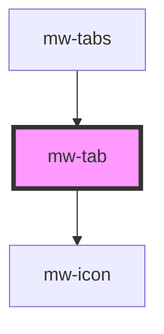

# mw-tab

<!-- Auto Generated Below -->

## Properties

| Property   | Attribute  | Description                        | Type      | Default     |
| ---------- | ---------- | ---------------------------------- | --------- | ----------- |
| `disabled` | `disabled` | Dictates if the tab is disabled    | `boolean` | `undefined` |
| `icon`     | `icon`     | Icon to be displayed               | `string`  | `undefined` |
| `label`    | `label`    | Label to be displayed              | `string`  | `undefined` |
| `selected` | `selected` | Dictates if tab has selected state | `boolean` | `undefined` |

## Dependencies

### Used by

 - [mw-tabs](../mw-tabs)

### Depends on

- [mw-icon](../mw-icon)

### Graph

----------------------------------------------

*Built with [StencilJS](https://stenciljs.com/)*
