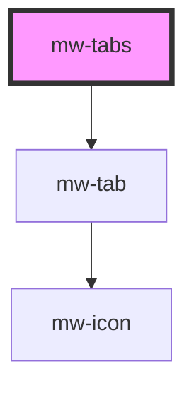

# mw-tabs

<!-- Auto Generated Below -->

## Properties

| Property   | Attribute  | Description                                                                | Type     | Default     |
| ---------- | ---------- | -------------------------------------------------------------------------- | -------- | ----------- |
| `selected` | `selected` | Dictates which tab is pre-selected. Omit if no tab should be pre-selected. | `number` | `null`      |
| `testId`   | `test-id`  | Test Id                                                                    | `string` | `undefined` |

## Events

| Event              | Description                        | Type                                 |
| ------------------ | ---------------------------------- | ------------------------------------ |
| `tabsClickEmitter` | Emits an event when tab is changed | `CustomEvent<{ selected: number; }>` |

## Dependencies

### Depends on

- [mw-tab](../mw-tab)

### Graph

---

_Built with [StencilJS](https://stenciljs.com/)_
