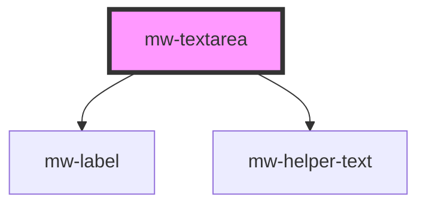

# mw-textarea

<!-- Auto Generated Below -->

## Properties

| Property      | Attribute     | Description                                                                                  | Type                                             | Default     |
| ------------- | ------------- | -------------------------------------------------------------------------------------------- | ------------------------------------------------ | ----------- |
| `cols`        | `cols`        | Visible width of textarea                                                                    | `number`                                         | `undefined` |
| `disabled`    | `disabled`    | Visually and functionally disabled input                                                     | `boolean`                                        | `false`     |
| `form`        | `form`        | formId                                                                                       | `string`                                         | `undefined` |
| `hasError`    | `has-error`   | Use to display input and helper-text in error state                                          | `boolean`                                        | `false`     |
| `helperText`  | `helper-text` | HelperText to be displayed. Can be used as hint or error text when combined with `has-error` | `string`                                         | `undefined` |
| `label`       | `label`       | Label to be displayed                                                                        | `string`                                         | `undefined` |
| `maxlength`   | `maxlength`   | Maximum allowed characters                                                                   | `number`                                         | `undefined` |
| `name`        | `name`        | input field name                                                                             | `string`                                         | `undefined` |
| `placeholder` | `placeholder` | Placeholder to be displayed                                                                  | `string`                                         | `undefined` |
| `readonly`    | `readonly`    | Whether user can't type in input field                                                       | `boolean`                                        | `false`     |
| `required`    | `required`    | Mark input as required                                                                       | `boolean`                                        | `false`     |
| `resize`      | `resize`      | enable or disable resizing option of textarea                                                | `"both" \| "horizontal" \| "none" \| "vertical"` | `"none"`    |
| `rows`        | `rows`        | Visible number of lines                                                                      | `number`                                         | `undefined` |
| `value`       | `value`       | input field value                                                                            | `string`                                         | `undefined` |

## Events

| Event           | Description       | Type                  |
| --------------- | ----------------- | --------------------- |
| `blurEmitter`   | emit blur event   | `CustomEvent<any>`    |
| `changeEmitter` | emit change event | `CustomEvent<any>`    |
| `inputEmitter`  | emit input event  | `CustomEvent<string>` |

## Dependencies

### Depends on

- [mw-label](../mw-label)
- [mw-helper-text](../mw-helper-text)

### Graph

---

_Built with [StencilJS](https://stenciljs.com/)_
