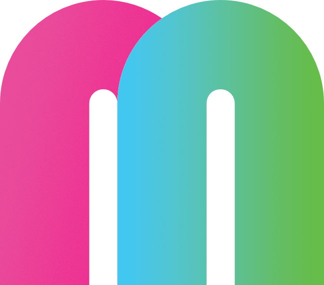
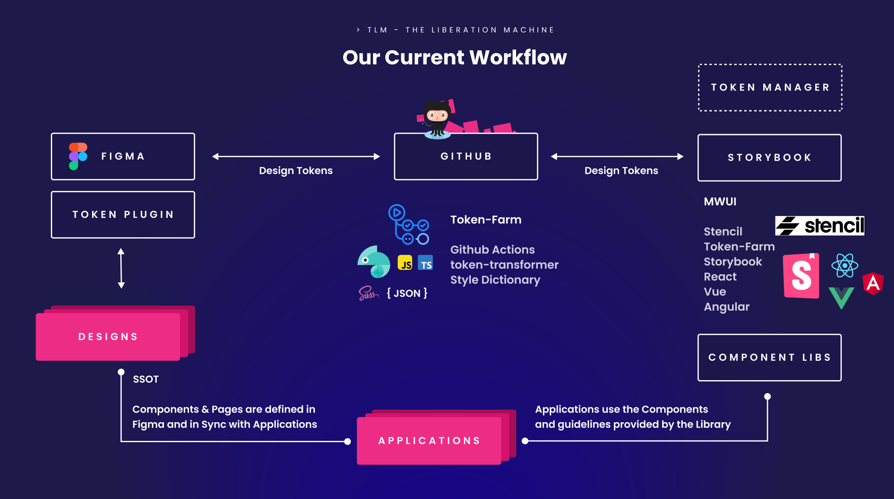

# The Liberation Machine - Component Library

![Built With Stencil](https://img.shields.io/badge/-Built%20With%20Stencil-16161d.svg?logo=data%3Aimage%2Fsvg%2Bxml%3Bbase64%2CPD94bWwgdmVyc2lvbj0iMS4wIiBlbmNvZGluZz0idXRmLTgiPz4KPCEtLSBHZW5lcmF0b3I6IEFkb2JlIElsbHVzdHJhdG9yIDE5LjIuMSwgU1ZHIEV4cG9ydCBQbHVnLUluIC4gU1ZHIFZlcnNpb246IDYuMDAgQnVpbGQgMCkgIC0tPgo8c3ZnIHZlcnNpb249IjEuMSIgaWQ9IkxheWVyXzEiIHhtbG5zPSJodHRwOi8vd3d3LnczLm9yZy8yMDAwL3N2ZyIgeG1sbnM6eGxpbms9Imh0dHA6Ly93d3cudzMub3JnLzE5OTkveGxpbmsiIHg9IjBweCIgeT0iMHB4IgoJIHZpZXdCb3g9IjAgMCA1MTIgNTEyIiBzdHlsZT0iZW5hYmxlLWJhY2tncm91bmQ6bmV3IDAgMCA1MTIgNTEyOyIgeG1sOnNwYWNlPSJwcmVzZXJ2ZSI%2BCjxzdHlsZSB0eXBlPSJ0ZXh0L2NzcyI%2BCgkuc3Qwe2ZpbGw6I0ZGRkZGRjt9Cjwvc3R5bGU%2BCjxwYXRoIGNsYXNzPSJzdDAiIGQ9Ik00MjQuNywzNzMuOWMwLDM3LjYtNTUuMSw2OC42LTkyLjcsNjguNkgxODAuNGMtMzcuOSwwLTkyLjctMzAuNy05Mi43LTY4LjZ2LTMuNmgzMzYuOVYzNzMuOXoiLz4KPHBhdGggY2xhc3M9InN0MCIgZD0iTTQyNC43LDI5Mi4xSDE4MC40Yy0zNy42LDAtOTIuNy0zMS05Mi43LTY4LjZ2LTMuNkgzMzJjMzcuNiwwLDkyLjcsMzEsOTIuNyw2OC42VjI5Mi4xeiIvPgo8cGF0aCBjbGFzcz0ic3QwIiBkPSJNNDI0LjcsMTQxLjdIODcuN3YtMy42YzAtMzcuNiw1NC44LTY4LjYsOTIuNy02OC42SDMzMmMzNy45LDAsOTIuNywzMC43LDkyLjcsNjguNlYxNDEuN3oiLz4KPC9zdmc%2BCg%3D%3D&colorA=16161d&style=flat-square)
[](https://www.npmjs.com/package/@maibornwolff/mwui-stencil)
[](https://maibornwolff.github.io/mwui-dev)


A web component library as part of the MW Design System project <strong>The Liberation Machine</strong>. Using Figma Token Studio plugin, we create modifiable Design Systems connected to a ready-to-use Web Component Library.

## Storybook

| Environment | URL                                     | Description                                                                                    |
| ----------- | --------------------------------------- | ---------------------------------------------------------------------------------------------- |
| Dev         | https://maibornwolff.github.io/mwui-dev | Reflects the current state of the main branch and updates automatically with changes in Figma. |
| Prod        | https://maibornwolff.github.io/mwui     | Reflects the state released on [npm](https://www.npmjs.com/search?q=%40maibornwolff%2Fmwui).   |

## The Design System Pipeline

All the Components are developed based on the mwui Design System in Figma. We use `Design Tokens` to version and synchronize design decisions between the Design and the WebComponents.

The [Token-Farm](mwui-token-farm/README.md) module transforms any changes in the Design Tokens into Style Dictionary outputs which are linked to the respective Web Component.



## Related Docs

-   [Token-Farm](mwui-token-farm/README.md)
-   [Stencil Library](mwui-stencil/README.md)
-   [React Library](mwui-react/README.md)
-   [Vue Library](mwui-vue/README.md)
-   [Angular Library](mwui-angular/README.md)
-   [Setup Figma Token Plugin](token-plugin.md)

## Contributing

> **Note**
>
> Adding a new Web Component should always be discussed with the Design Team to have the right Tokens and Designs in place. We prefer component-specific tokens over semantic or core tokens. Missing tokens are discussed with Design Team.

We use [Github Projects](https://github.com/orgs/MaibornWolff/projects/4/views/1) to organize tasks and issues linked to this Repository.

Follow this checklist to comply with our definition of done.

-   [x] components are tested
-   [x] components are represented in Storybook
-   [x] components are documented (e.g. storybook mdx doc)
-   [x] components are reviewed together with design team

### Documentation

A stencil component ideally is created using the CLI command `npm run generate` inside the mwui-stencil directory. Each component should be represented in various states and variants in a Storybook `*.stories.ts` file. If there is more complex documentation needed, both a stories file and a customized `*.docs.mdx` file (e.g. [mw-button.docs.mdx](https://github.com/MaibornWolff/mwui/blob/main/mwui-stencil/src/components/mw-button/mw-button.docs.mdx)) can and should be provided.

To further improve automated component docs, make sure to correctly type `Properties` and provide comments to each prop (those will show up in the Storybook ArgsTable in addition to the default output generated).

### Build & Release Libraries

We maintain several packages, including the core (mwui-stencil), token transformation and framework specific component libraries. Learn more about the [build and release process](./release.md).

| Package                      | Status                                                                                                                                                                  |
| ---------------------------- | ----------------------------------------------------------------------------------------------------------------------------------------------------------------------- |
| @maiborwolff/mwui-stencil    | [](https://www.npmjs.com/package/@maibornwolff/mwui-stencil)          |
| @maiborwolff/mwui-token-farm | [](https://www.npmjs.com/package/@maibornwolff/mwui-token-farm) |
| @maibornwolff/mwui-react     | [](https://www.npmjs.com/package/@maibornwolff/mwui-react)                 |
| @maibornwolff/mwui-vue       | [](https://www.npmjs.com/package/@maibornwolff/mwui-vue)                       |
| @maibornwolff/mwui-angular   | [](https://www.npmjs.com/package/@maibornwolff/mwui-angular)           |

### Usage in React, Vue and Angular

To leverage the usage of our WebComponents we provide framework-specific wrappers for React, Vue and Angular. You can install and use the mwui Components accordingly:

```bash
npm install @maibornwolff/mwui-react # in React
npm install @maibornwolff/mwui-vue # in Vue
npm install @maibornwolff/mwui-angular # in Angular

# you might also need the core package to have access to global stylings, see [React](mwui-react/README.md) for more information.
npm install @maibornwolff/mwui-stencil
```

For more info on the individual wrappers, check out the [React](mwui-react/README.md), [Vue](mwui-vue/README.md) or [Angular](mwui-angular/README.md) documentation.

### Use as Web Components

To install the library within the chosen framework, run:

```bash
npm install @maibornwolff/mwui-stencil
```

Include the following in the `main.js` (e.g. Angular, Vue) or `index.js` (e.g. React):

```JavaScript
import { defineCustomElements } from "@maibornwolff/mwui-stencil/loader";
defineCustomElements(window);
```

### Styling

To ensure CSS variables are available, import the global stylesheet in your Application root.

```javascript
import "@maibornwolff/mwui-stencil/dist/mwui-stencil/mwui-stencil.css";
```

The CSS variables are used within the Web Components and you can also refer to them styling your own layout and elements.
