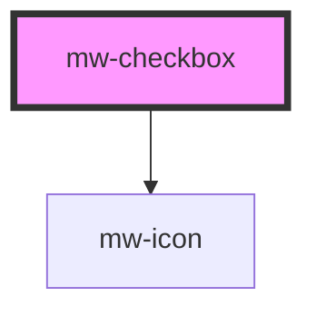

# mw-checkbox

<!-- Auto Generated Below -->

## Properties

| Property              | Attribute  | Description                            | Type      | Default     |
| --------------------- | ---------- | -------------------------------------- | --------- | ----------- |
| `checked`             | `checked`  | Whether input is checked               | `boolean` | `undefined` |
| `disabled`            | `disabled` | Whether input is disabled              | `boolean` | `undefined` |
| `name`                | `name`     | Name of checkbox input                 | `string`  | `undefined` |
| `testId` _(required)_ | `test-id`  | Must be provided for automated testing | `string`  | `undefined` |
| `value`               | `value`    | Value of checkbox input                | `string`  | `undefined` |

## Dependencies

### Depends on

- [mw-icon](../mw-icon)

### Graph

----------------------------------------------

*Built with [StencilJS](https://stenciljs.com/)*
