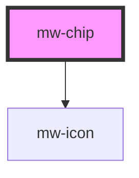

# mw-chip

<!-- Auto Generated Below -->

## Properties

| Property              | Attribute  | Description                                     | Type      | Default     |
| --------------------- | ---------- | ----------------------------------------------- | --------- | ----------- |
| `close`               | `close`    | Flag wether to show close icon or not           | `boolean` | `false`     |
| `disabled`            | `disabled` | Visually and functionally disable button        | `boolean` | `undefined` |
| `icon`                | `icon`     | Name identifier of icon to be displayed in chip | `string`  | `undefined` |
| `testId` _(required)_ | `test-id`  | Must be provided for automated testing          | `string`  | `undefined` |

## Events

| Event          | Description | Type                  |
| -------------- | ----------- | --------------------- |
| `clickEmitter` |             | `CustomEvent<string>` |

## Dependencies

### Depends on

- [mw-icon](../mw-icon)

### Graph

----------------------------------------------

*Built with [StencilJS](https://stenciljs.com/)*
