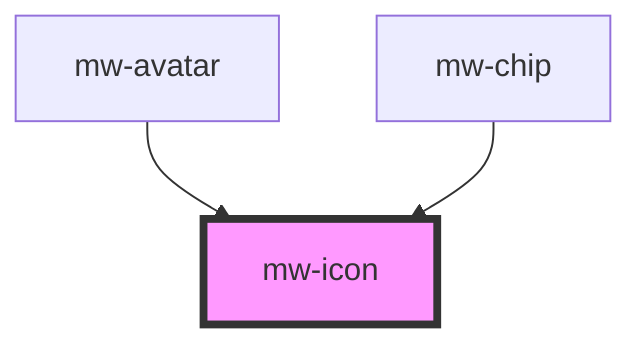

# mw-icon

<!-- Auto Generated Below -->

## Properties

| Property | Attribute | Description                  | Type                                          | Default     |
| -------- | --------- | ---------------------------- | --------------------------------------------- | ----------- |
| `color`  | `color`   | Overwrite default color      | `string`                                      | `undefined` |
| `icon`   | `icon`    | The icon name to be rendered | `string`                                      | `null`      |
| `size`   | `size`    | Size variant                 | `"large" \| "medium" \| "small" \| "x-small"` | `'medium'`  |

## Dependencies

### Used by

 - [mw-avatar](../mw-avatar)
 - [mw-chip](../mw-chip)

### Graph

----------------------------------------------

*Built with [StencilJS](https://stenciljs.com/)*
