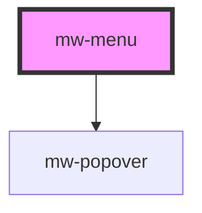

# mw-menu

<!-- Auto Generated Below -->

## Properties

| Property              | Attribute | Description                            | Type     | Default     |
| --------------------- | --------- | -------------------------------------- | -------- | ----------- |
| `testId` _(required)_ | `test-id` | Must be provided for automated testing | `string` | `undefined` |

## Dependencies

### Depends on

- [mw-popover](../mw-popover)

### Graph

----------------------------------------------

*Built with [StencilJS](https://stenciljs.com/)*
